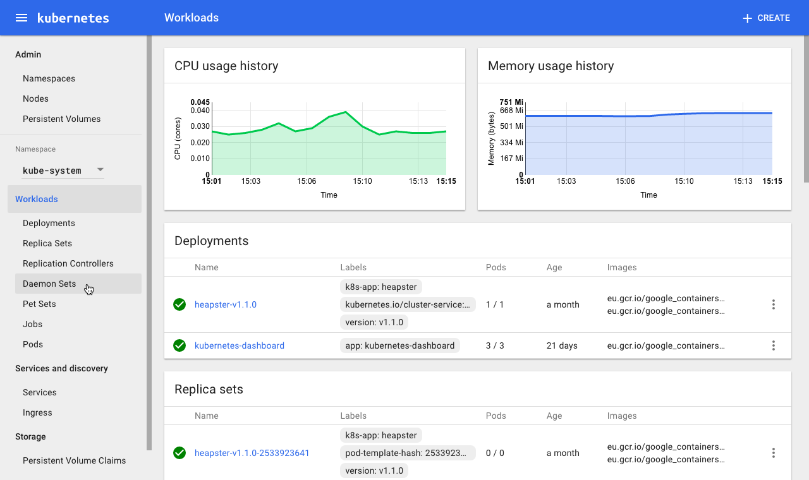

<!-- toc -->

tags: dashboard

# dashboard pluginのデプロイ

デプロイ用ファイルの所属フォルダ：`kubernetes/cluster/addons/dashboard`

デプロイ用ファイル：

``` bash
$ ls *.yaml
dashboard-controller.yaml  dashboard-rbac.yaml  dashboard-service.yaml
```

+ dashboard に使わせるため、`dashboard-rbac.yaml` ファイルを追加する

`kube-apiserver` は `RBAC` を使っているが、デプロイ用 `dashboard-controller.yaml` ファイルで ServiceAccount の設定ファイルがない。
`kube-apiserver` の API へアクセスできない、エラー画面が下記のような表示する：


解決方法：`dashboard` という dashboard 用の ServiceAccount ファイルを作成して、 Cluster Role view と紐付ける。

已经修改好的 yaml 文件见：[dashboard](./manifests/dashboard)を参考してください

## dashboard-service の設定

``` bash
$ diff dashboard-service.yaml.orig dashboard-service.yaml
10a11
>   type: NodePort
```

+ NodePort をポードタイプを設定して、外部から nodeIP:nodePort で dashboard へアクセスできる

## dashboard-controller の設定

``` bash
20a21
>       serviceAccountName: dashboard
```

+ 名前が dashboard の ServiceAccount 設定を追加する

## dashboard のデプロイ

``` bash
$ pwd
/home/ccheng/kubernetes/cluster/addons/dashboard
$ ls *.yaml
dashboard-controller.yaml  dashboard-rbac.yaml  dashboard-service.yaml
$ kubectl create -f  .
$
```

## 結果確認

NodePort の確認

``` bash
$ kubectl get services kubernetes-dashboard -n kube-system
NAME                   CLUSTER-IP       EXTERNAL-IP   PORT(S)        AGE
kubernetes-dashboard   10.254.224.130   <nodes>       80:30312/TCP   25s
```

+ NodePort 30312 と dashboard pod 80 が紐づけてる；

controller の確認

``` bash
$ kubectl get deployment kubernetes-dashboard  -n kube-system
NAME                   DESIRED   CURRENT   UP-TO-DATE   AVAILABLE   AGE
kubernetes-dashboard   1         1         1            1           3m
$ kubectl get pods  -n kube-system | grep dashboard
kubernetes-dashboard-1339745653-pmn6z   1/1       Running   0          4m
```

## dashboard へアクセス

1. kubernetes-dashboard は NodePort を設定したので、`http://NodeIP:nodePort` で dashboard へアクセス；
1. kube-apiserver に経由で dashboard へアクセス；
1. kubectl proxy に経由で dashboard へアクセス：

### 通过 kubectl proxy 访问 dashboard

Porxyを起動する

``` bash
$ kubectl proxy --address='10.64.3.7' --port=8086 --accept-hosts='^*$'
Starting to serve on 10.64.3.7:8086
```

+ `--accept-hosts` の指定が必要です、指定しなければ、dashboardへアクセスする時、"Unauthorized"を表示する；

ブラワザで `http://10.64.3.7:8086/ui` へアクセスしたら
自動で `http://10.64.3.7:8086/api/v1/proxy/namespaces/kube-system/services/kubernetes-dashboard/#/workload?namespace=default` へ遷移する

### 通过 kube-apiserver 访问dashboard

クラスターのIPアドレスリストの取得

``` bash
$ kubectl cluster-info
Kubernetes master is running at https://172.17.35.59:6443
Elasticsearch is running at https://172.17.35.59:6443/api/v1/proxy/namespaces/kube-system/services/elasticsearch-logging
Heapster is running at https://172.17.35.59:6443/api/v1/proxy/namespaces/kube-system/services/heapster
Kibana is running at https://172.17.35.59:6443/api/v1/proxy/namespaces/kube-system/services/kibana-logging
KubeDNS is running at https://172.17.35.59:6443/api/v1/proxy/namespaces/kube-system/services/kube-dns
kubernetes-dashboard is running at https://172.17.35.59:6443/api/v1/proxy/namespaces/kube-system/services/kubernetes-dashboard
monitoring-grafana is running at https://172.17.35.59:6443/api/v1/proxy/namespaces/kube-system/services/monitoring-grafana
monitoring-influxdb is running at https://172.17.35.59:6443/api/v1/proxy/namespaces/kube-system/services/monitoring-influxdb
```

kube-apiserver の認証が RBAC を使っているので、しかし、ブラウザで kube-apiserver へアクセスする時、証明書を使っていないので、httpsでアクセスすると、失敗になる。なので**http**で kube-apiserver へアクセスしてください：

URL：`http://10.64.3.7:8080/api/v1/proxy/namespaces/kube-system/services/kubernetes-dashboard`



Heapster プラグインがないので，今使っている dashboard は Pod、Nodes の CPU、メモリなど metric 統計画像を表示できない；