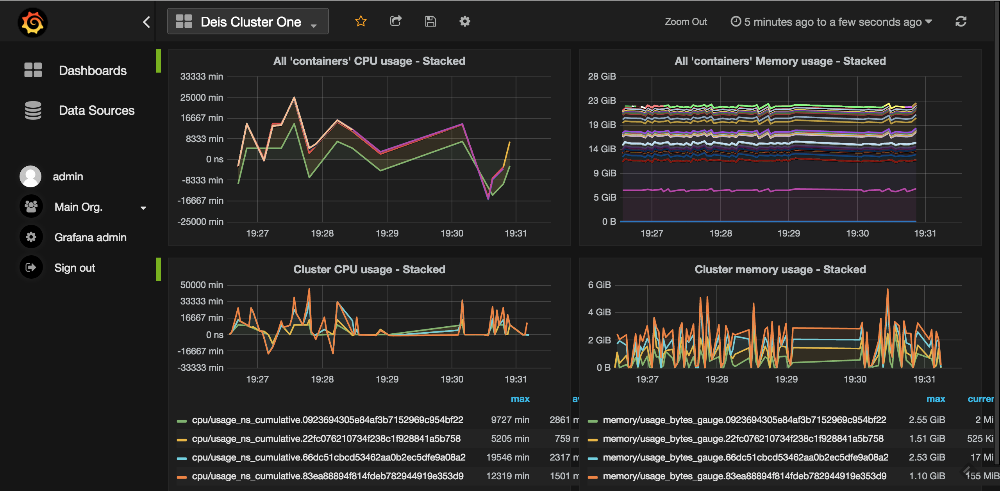
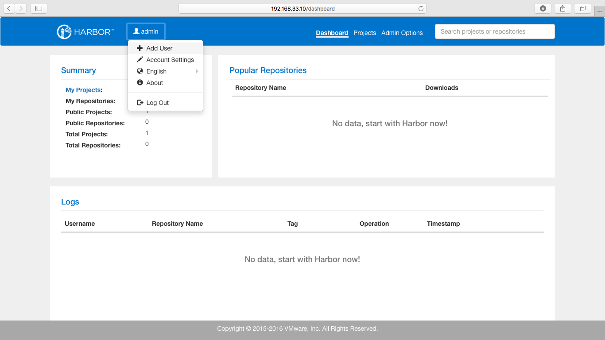

# Kubernetesクラスター環境構築学習

Kubernetesの構築手順書の説明

ドキュメントがKubernetesの各コンポーネントの間の通信、動作など情報を詳しく記載している。

1.[コンポーネントバージョンとクラスター環境](./01_ready_to_deploy_a_kubernetes_cluster.md)  
2.[CA 証明書とキーファイルの作成](./02_create_ca_certificate_and_key.md)  
3.[高可用性の etcd クラスター環境の構築](./03_deploy_high_available_etcd_cluster.md)  
4.[kubectlのデプロイ](./04_deploy_kubectl_command_tools.md)  
5.[Flannel ネットワークのデプロイ](./05_deploy_flannel_network.md)  
6.Kubenetes Master Nodeのデプロイ  
7.Kubenetes Slave Nodeのデプロイ  
8.DNS プラグインのデプロイ  
9.Dashboard プラグインのデプロイ  
10.Heapster プラグインのデプロイ  
11.EFK プラグインのデプロイ  
12.Docker Registry プラグインのデプロイ  
13.Harbor プラグインのデプロイ  
14.クラスタークリア  

[it2911研究Blog](http://www.it2911.com)
